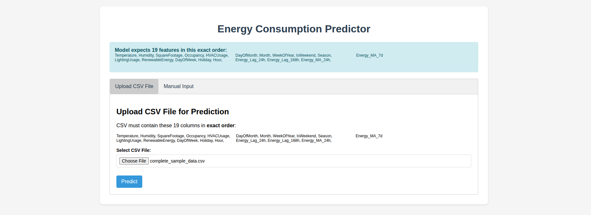
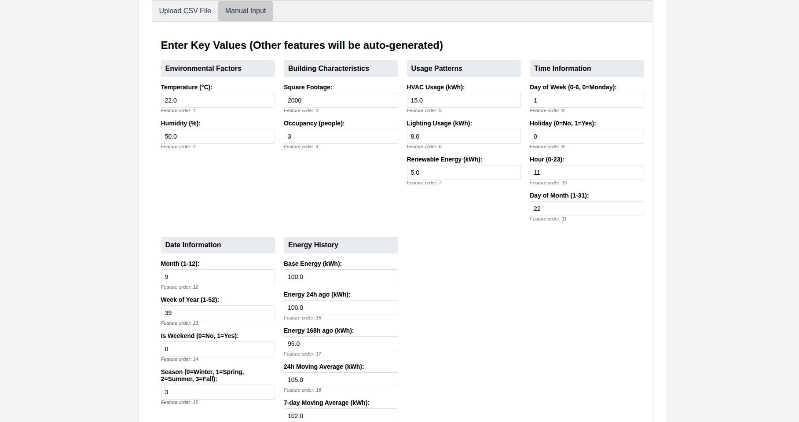
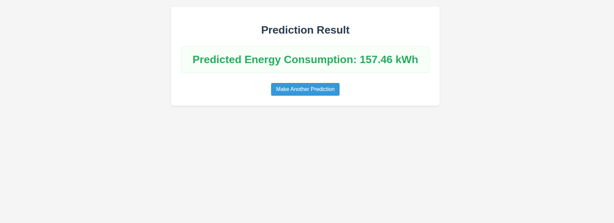
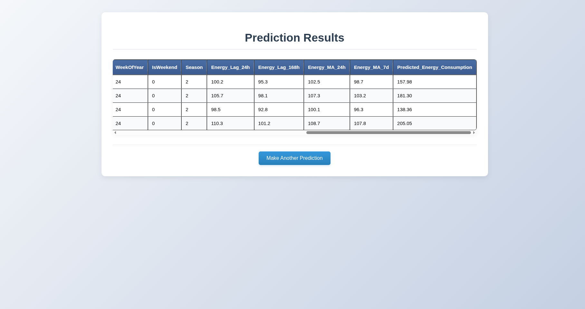

# Power Consumption Analysis

This Jupyter Notebook analyzes energy consumption data from a CSV file (`Energy_consumption.csv`).  
The dataset includes features such as timestamp, temperature, humidity, square footage, occupancy, HVAC usage, lighting usage, renewable energy, day of the week, holiday, and energy consumption.  
The notebook performs **data loading, exploration, cleaning, preprocessing, and feature engineering** to prepare the data for further analysis or modeling.

---

## 📊 Dataset Description
The dataset contains **1000 entries** with the following columns:

- **Timestamp**: Date and time of the record  
- **Temperature**: Temperature reading  
- **Humidity**: Humidity reading  
- **SquareFootage**: Area in square feet  
- **Occupancy**: Number of occupants  
- **HVACUsage**: Whether HVAC is on or off  
- **LightingUsage**: Whether lighting is on or off  
- **RenewableEnergy**: Amount of renewable energy generated  
- **DayOfWeek**: Day of the week  
- **Holiday**: Whether it is a holiday  
- **EnergyConsumption**: Target variable (energy consumption)  

---

## ⚙️ Steps Performed

### 1. Data Loading and Initial Exploration
- Loaded the dataset using **pandas**  
- Displayed the first few rows and basic statistics  
- Checked for missing values and duplicates  

### 2. Data Cleaning
- No missing values or duplicates found  
- Converted the **Timestamp** column to datetime and set it as the index  
- Mapped categorical columns (**HVACUsage, LightingUsage, Holiday**) to numerical values  
- Mapped **DayOfWeek** to numerical values (Monday = 0, Sunday = 6)  

### 3. Feature Engineering
Extracted new features from the timestamp:
- **Hour**: Hour of the day  
- **DayOfMonth**: Day of the month  
- **Month**: Month of the year  
- **WeekOfYear**: Week number of the year  
- **IsWeekend**: Binary indicator for weekend  
- **Season**: Season of the year (1–4)  

### 4. Data Visualization *(Planned)*
- **matplotlib** and **seaborn** are imported  
- Visualizations will include correlations, seasonal trends, and usage patterns  

---

## 🚀 Usage
1. Ensure the dataset `Energy_consumption.csv` is in the same directory as the notebook.  
2. Run the notebook cells sequentially to load, clean, and preprocess the data.  
3. Use the processed data for further analysis or modeling.  

---
## 🖥️ Web App (Flask UI)

This project also includes a **Flask-based web interface** for making predictions.  
You can either upload a CSV file or provide manual inputs.

### Features
- Upload CSV with required 19 columns
- Predict energy consumption instantly
- Simple and clean Bootstrap UI

### Screenshots
#### Upload CSV for Prediction


#### Prediction Result


#### Prediction Result


#### Prediction Result


## 📦 Dependencies
- [pandas](https://pandas.pydata.org/)  
- [matplotlib](https://matplotlib.org/)  
- [seaborn](https://seaborn.pydata.org/)  

Install dependencies using:  
```bash
pip install pandas matplotlib seaborn flash
